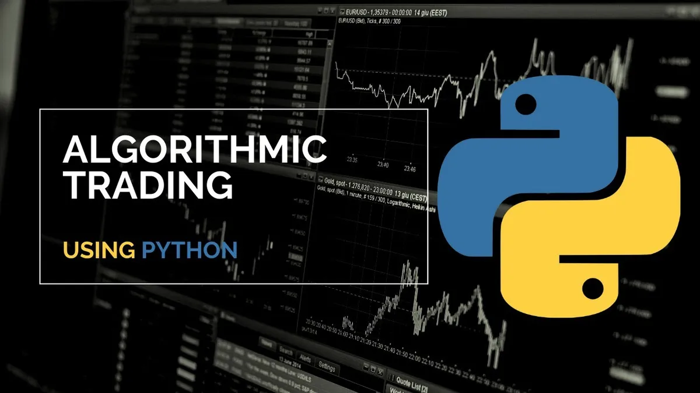
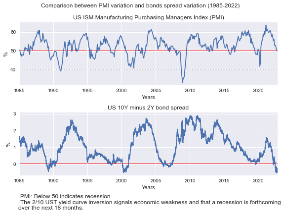
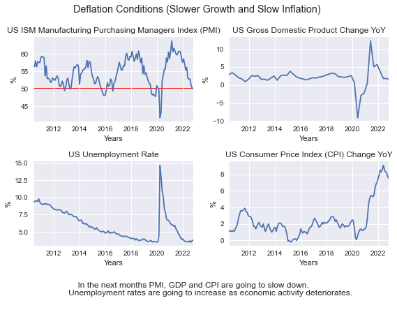
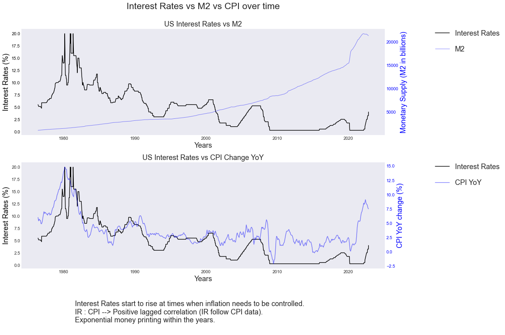
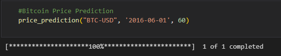
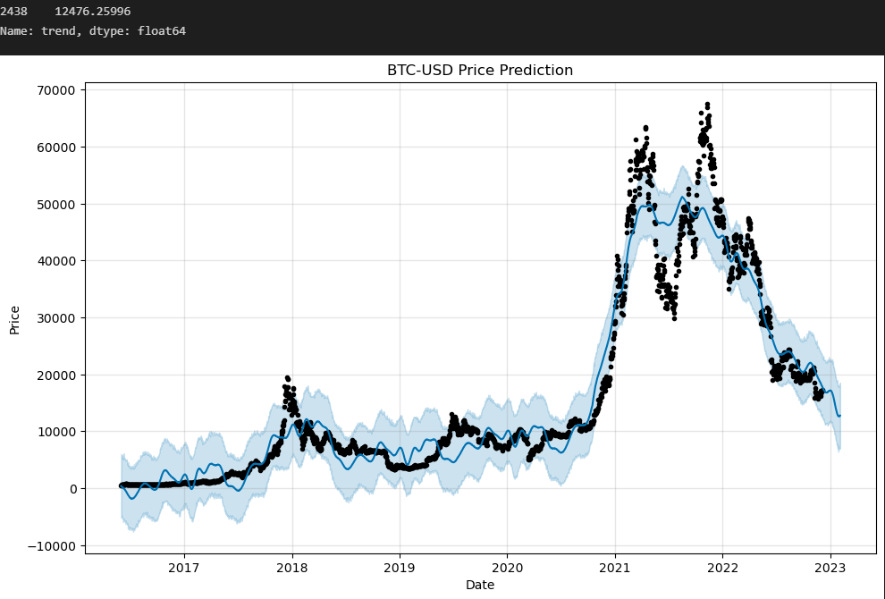
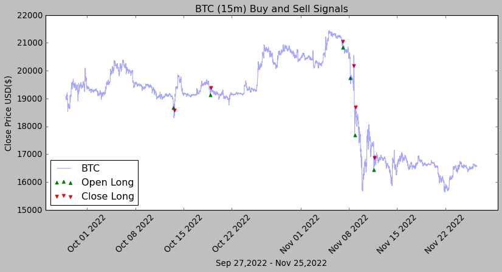
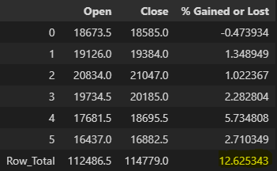

# Final Project - Introduction to Quantitative Trading (working with Python Algorithms)

### Author: 
Carlos Muñoz Fresco

## Introduction: 
The idea behind this project is to:
- Analyze the current US economy, exploring the data from TradingView. 
- Make predictions of the U.S. stock market (S&P 500 and NASDAQ 100), Gold and Bitcoin, fitting the Prophet() model.
- Back test and create a profitable trading strategy.
- Implement the Trading Strategy, deploying a crypto trading bot, connected to Bybit's API.

## Variables: 
The variables used to analyze market conditions are split in four cycles: 
1. **Credit Cycle**: 
    - 10Y Bond minus 2Y Bond Spread
    - Interest Rates
    - Dollar index (DXY)
    - Volatility index (VIX)

        ##### *Comparison between PMI and US bond Spreads* 
        

    

2.  **Growth Cycle**: 
    - Gross Domestic Product (GDP) Change YoY
    - Manufacturing Purchasing Managers Index (PMI)
    - Unemployment Rate

        ##### *Comparison between PMI, GDP Change YoY, Unemployment Rate, CPI Change YoY*

    

3. **Inflation Cycle**:
    - Consumer Price Index (CPI) Change YoY

        ##### *Comparison between Interest Rates, Monetary Supply (M2) and CPI Change YoY*

    

4. **Liquidity Cycle**: 
    - Monetary Supply (M2)

        ##### *Comparison between Monetary Supply (M2) and Asset Price Changes within time*

    

## Assets:
The assets for which I will predict their future price are:
- Bitcoin (BTC)
- SP 500 index (SP 500)
- NASDAQ 100 index (NDX 100)
- Gold (Gold)

## Prediction Model:
To predict stock prices I used the Prophet() model developed by the Data Science Team of Facebook. You will find the predictions inside the prediction_model folder. 

I attach below the Bitcoin price Prediction in 60 days, its looking bearish!!!

### What I thought about when deciding to create the trading strategy:

Looking at the economic variables and the forecasted outlook of asset prices, I decided that I wanted to catch small bounces in price movements when the asset (in this case, Bitcoin) reaches really oversold levels. 

Investigated about the RSI indicator (measures how oversold or overbought an asset is) and the RSI Stoch Indicator (measures the asset price momentum).

## Back testing trading strategies: 
To compare and make sure that a strategy is profitable, it is necessary to compare different strategies in different time frames, in different market conditions. After many attempts, I realized that a trading strategy is never perfect and needs readjustments depending on market conditions. 

In this study I explored the Bitcoin price and tried different buying and selling conditions. I tried using the 15-minute time frame, the 1-hour time frame and the 4-hour time frame.

After seeing the different results, I decided to focus on the lower time frames, especially the 15 minute time frame. The Long Strategy gave good results so I implemented it, creating a trading bot. 

You will find the backtesting strategies and their data inside the backtesting_bot folder. 

The strategy implemented is the first strategy contemplated and visualized in the btc_15.ipynb jupyter notebook file (LONG strategy).

## Results: 

Since late September 2022 until late November 2022 (2 months), this strategy would have executed 6 trades. The first trade was a losing trade, but the next 5 were winning trades.

- Win ratio: 5/6
- Profitability: 12,63%

## Trading Bot:
I established connection with my Bybit's account via an API key and secret tokens and managed to implement the BTC/USDT (15 min) LONG trading strategy.

The implemented strategy with the bot running is found at the trading_bot folder, inside of bot.ipynb jupyter notebook file.

The buying conditions will be:
- RSI < 20 (oversold indicator)
- K < 0.2 (low momentum)

The selling conditions will be:
- RSI > 45 (indicator no longer shows oversold conditions)
- Buyprice * 1.02 (2% gain in price movement) - The original strategy does not have this (........but it is a good indicator of taking profits!!!)
- Buyprice * 0.98 (2% loss in price movement) - The original strategy does not have this (........but it is a good way to manage risks to the downside!!!)
